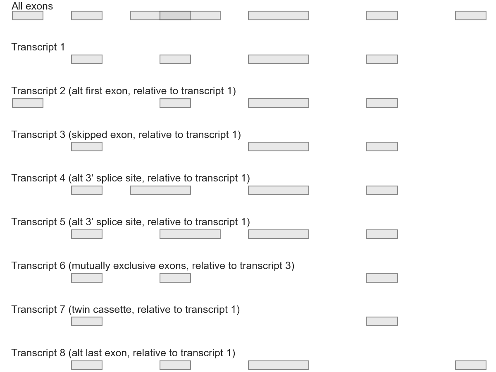

# Outrigger

[](https://travis-ci.org/YeoLab/outrigger)[](https://pypi.python.org/pypi/outrigger)[](https://coveralls.io/github/YeoLab/outrigger?branch=master)

Outrigger is an aggregation of scripts and tools to annotate exons and their 
predicted functions.

* Free software: BSD license
* Documentation: https://yeolab.github.io/outrigger

## Installation

### Bleeding edge code from Github (here)

For advanced users, if you have [git](https://git-scm.com/) and [Anaconda Python](https://www.continuum.io/downloads) installed, you can:

1. Clone this repository
2. Change into that directory
3. Create an environment with the necessary packages from Anaconda
4. Activate the environment
5. Install remaining packages from PyPI ([`graphlite`](https://github.com/eugene-eeo/graphlite) is only available on PyPI, not as a `conda` package) 
6. Install this package

These steps are shown in code below.

```
git clone git@github.com:YeoLab/outrigger
cd outrigger
conda create --name outrigger --yes --file conda_requirements.txt --channel bioconda
source activate outrigger
pip install -r requirements.txt
pip install .
```


## Features

### Aggregate splice junctions into splicing events

Using just junction information, we can annotate these kinds of splicing 
events:

- Alternative first exon (AFE)
- Skipped exon (SE)
- Alternative 5' splice site (A5SS)
- Alternative 3' splice site (A3SS)
- Mutually exclusive exon (MXE)
- Twin cassette (TWIN)
- Alternative last exon (ALE)

For a demonstration, see the transcripts below.



### Read HMMScan output

After running HMMScan, the output is extensive and helpful, but non-trivial to parse into a dataframe-style format
since the separators are variable lengths of spaces, and the domain descriptions also have spaces, so parsing is
ambiguous. Here's an example output file, of using the [RBFOX2](http://en.wikipedia.org/wiki/RBM9) protein sequence
as a query, and scanning against the Pfam-A (manually curated) families from the Pfam version 27:

```
#                                                                             --- full sequence --- -------------- this domain -------------   hmm coord   ali coord   env coord
# target name        accession   tlen query name            accession   qlen   E-value  score  bias   #  of  c-Evalue  i-Evalue  score  bias  from    to  from    to  from    to  acc description of target
#------------------- ---------- -----  -------------------- ---------- ----- --------- ------ ----- --- --- --------- --------- ------ ----- ----- ----- ----- ----- ----- ----- ---- ---------------------
Fox-1_C              PF12414.3     93 sp|O43251|RFOX2_HUMAN -            390   3.2e-39  133.2  29.5   1   2      0.23   6.7e+02    0.7   0.0    14    48   177   213   166   243 0.66 Calcitonin gene-related peptide regulator C terminal
Fox-1_C              PF12414.3     93 sp|O43251|RFOX2_HUMAN -            390   3.2e-39  133.2  29.5   2   2   8.9e-42   2.6e-38  130.2  27.3     2    93   265   362   264   362 0.97 Calcitonin gene-related peptide regulator C terminal
RRM_1                PF00076.17    70 sp|O43251|RFOX2_HUMAN -            390     8e-19   67.0   0.1   1   1   5.9e-22   1.7e-18   65.9   0.1     2    70   124   191   123   191 0.97 RNA recognition motif. (a.k.a. RRM, RBD, or RNP domain)
RRM_6                PF14259.1     70 sp|O43251|RFOX2_HUMAN -            390   2.4e-15   56.2   0.1   1   1   1.4e-18   4.3e-15   55.4   0.1     1    70   123   191   123   191 0.95 RNA recognition motif (a.k.a. RRM, RBD, or RNP domain)
RRM_5                PF13893.1     56 sp|O43251|RFOX2_HUMAN -            390   8.1e-11   41.6   0.1   1   1   5.9e-14   1.8e-10   40.5   0.1     1    54   137   193   137   195 0.90 RNA recognition motif. (a.k.a. RRM, RBD, or RNP domain)
RRM_3                PF08777.6    105 sp|O43251|RFOX2_HUMAN -            390     0.084   12.7   0.0   1   1   6.7e-05       0.2   11.5   0.0    17    79   136   202   127   206 0.83 RNA binding motif
#
# Program:         hmmscan
# Version:         3.1b1 (May 2013)
# Pipeline mode:   SCAN
# Query file:      /projects/ps-yeolab/genomes/pfam/release_27/ftp.sanger.ac.uk/pub/databases/Pfam/releases/Pfam27.0/RBFOX2_human.fasta
# Target file:     /projects/ps-yeolab/genomes/pfam/release_27/ftp.sanger.ac.uk/pub/databases/Pfam/releases/Pfam27.0/Pfam-A.hmm
# Option settings: hmmscan --domtblout RBFOX2_human_pfam.txt --noali --notextw /projects/ps-yeolab/genomes/pfam/release_27/ftp.sanger.ac.uk/pub/databases/Pfam/releases/Pfam27.0/Pfam-A.hmm /projects/ps-yeolab/genomes/pfam/release_27/ftp.sanger.ac.uk/pub/databases/Pfam/releases/Pfam27.0/RBFOX2_human.fasta
# Current dir:     /home/obotvinnik/ipython_notebook/miso
# Date:            Tue Jan 27 18:56:23 2015
# [ok]
```

You can read in this file using `read_hmmscan_out`, as such:

```python
from outrigger.hmmscan import read_hmmscan
hmmscan_df = read_hmmscan('rbfox2_hmmscan.txt')
```

This will give you a pandas dataframe which looks like this:

<table border="1" class="dataframe">  <thead>    <tr style="text-align: right;">      <th></th>      <th>target_name</th>      <th>target_accession</th>      <th>target_length</th>      <th>query_name</th>      <th>query_accession</th>      <th>query_length</th>      <th>sequence_e_value</th>      <th>sequence_score</th>      <th>sequence_bias</th>      <th>domain_number</th>      <th>domain_total</th>      <th>domain_conditional_e_value</th>      <th>domain_independent_e_value</th>      <th>domain_score</th>      <th>domain_bias</th>      <th>target_start</th>      <th>target_stop</th>      <th>query_start</th>      <th>query_stop</th>      <th>query_domain_envelope_start</th>      <th>query_domain_envelope_stop</th>      <th>mean_posterior_probability</th>      <th>target_description</th>    </tr>  </thead>  <tbody>    <tr>      <th>0</th>      <td>Fox-1_C</td>      <td>PF12414.3</td>      <td>93</td>      <td>sp|O43251|RFOX2_HUMAN</td>      <td>-</td>      <td>390</td>      <td>3.200000e-39</td>      <td>133.2</td>      <td>29.5</td>      <td>1</td>      <td>2</td>      <td>2.300000e-01</td>      <td>6.700000e+02</td>      <td>0.7</td>      <td>0.0</td>      <td>14</td>      <td>48</td>      <td>177</td>      <td>213</td>      <td>166</td>      <td>243</td>      <td>0.66</td>      <td>Calcitonin gene-related peptide regulator C te...</td>    </tr>    <tr>      <th>1</th>      <td>Fox-1_C</td>      <td>PF12414.3</td>      <td>93</td>      <td>sp|O43251|RFOX2_HUMAN</td>      <td>-</td>      <td>390</td>      <td>3.200000e-39</td>      <td>133.2</td>      <td>29.5</td>      <td>2</td>      <td>2</td>      <td>8.900000e-42</td>      <td>2.600000e-38</td>      <td>130.2</td>      <td>27.3</td>      <td>2</td>      <td>93</td>      <td>265</td>      <td>362</td>      <td>264</td>      <td>362</td>      <td>0.97</td>      <td>Calcitonin gene-related peptide regulator C te...</td>    </tr>    <tr>      <th>2</th>      <td>RRM_1</td>      <td>PF00076.17</td>      <td>70</td>      <td>sp|O43251|RFOX2_HUMAN</td>      <td>-</td>      <td>390</td>      <td>8.000000e-19</td>      <td>67.0</td>      <td>0.1</td>      <td>1</td>      <td>1</td>      <td>5.900000e-22</td>      <td>1.700000e-18</td>      <td>65.9</td>      <td>0.1</td>      <td>2</td>      <td>70</td>      <td>124</td>      <td>191</td>      <td>123</td>      <td>191</td>      <td>0.97</td>      <td>RNA recognition motif. (a.k.a. RRM, RBD, or RN...</td>    </tr>    <tr>      <th>3</th>      <td>RRM_6</td>      <td>PF14259.1</td>      <td>70</td>      <td>sp|O43251|RFOX2_HUMAN</td>      <td>-</td>      <td>390</td>      <td>2.400000e-15</td>      <td>56.2</td>      <td>0.1</td>      <td>1</td>      <td>1</td>      <td>1.400000e-18</td>      <td>4.300000e-15</td>      <td>55.4</td>      <td>0.1</td>      <td>1</td>      <td>70</td>      <td>123</td>      <td>191</td>      <td>123</td>      <td>191</td>      <td>0.95</td>      <td>RNA recognition motif (a.k.a. RRM, RBD, or RNP...</td>    </tr>    <tr>      <th>4</th>      <td>RRM_5</td>      <td>PF13893.1</td>      <td>56</td>      <td>sp|O43251|RFOX2_HUMAN</td>      <td>-</td>      <td>390</td>      <td>8.100000e-11</td>      <td>41.6</td>      <td>0.1</td>      <td>1</td>      <td>1</td>      <td>5.900000e-14</td>      <td>1.800000e-10</td>      <td>40.5</td>      <td>0.1</td>      <td>1</td>      <td>54</td>      <td>137</td>      <td>193</td>      <td>137</td>      <td>195</td>      <td>0.90</td>      <td>RNA recognition motif. (a.k.a. RRM, RBD, or RN...</td>    </tr>  </tbody></table>


### Splice site scoring

If you want to use [MaxEntScan](http://genes.mit.edu/burgelab/maxent/Xmaxentscan_scoreseq.html) to score splice sites, this is  the feature for you!

To use this feature, you must have [`BioPerl` installed](http://bioperl.org/wiki/Installing_BioPerl).

Say you want to test the strength of these 5' splice sites, which we'll call
`dummy5.fasta`. Notice these 5' splice site sequences are exactly 9 bases long,
as described in the [MaxEntScan `score5ss` documentation](http://genes.mit.edu/burgelab/maxent/Xmaxentscan_scoreseq.html).

```
> dummy1
cagGTAAGT
> dummy2
gagGTAAGT
> dummy3
taaATAAGT
```

Then we can get the splice site strength using `score_splice_fasta`

```
from outrigger.splicestrength import score_splice_fasta
scores = score_splice_fasta('dummy5.fasta', splice_site=5)
```

Notice the `splice_site=5` keyword argument. If you are scoring 3' splice sites
(with length 23 sequences as described in the [MaxEntScan `score3ss` documentation](http://genes.mit.edu/burgelab/maxent/Xmaxentscan_scoreseq_acc.html),
then set `splice_site=3`.

The output `scores` is the exact `stdout` output from the original MaxEntScan perl
program, which is a string that looks like this:

```
cagGTAAGT   10.86
gagGTAAGT   11.08
taaATAAGT   0.12
```
