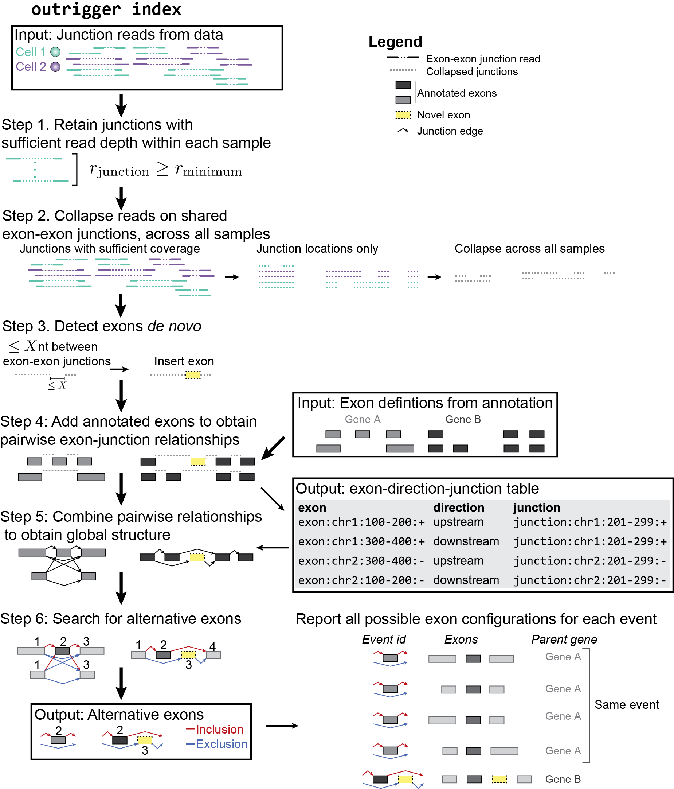

``index``: Build a *de novo* splicing annotation index of events custom to **your** data
========================================================================================

Overview
--------
The purpose of ``outrigger index`` is to create a custom splicing database
containing alternative exons that appear in your data. This program detects
exons *de novo* and uses an annotation to supplement exon definitions. Then, it
builds a graph database of all possible alternative SE and MXE events in your
dataset. The events are defined by their junctions and alternative exons, and
all possible flanking exons. The same event may have multiple flanking exons,
but all those events will ultimately have their percent spliced-in calculated
the same way.

|OutriggerIndex|

Inputs
------

This section will describe all possible inputs to ``outrigger index``.

Example command using ``SJ.out.tab`` files
~~~~~~~~~~~~~~~~~~~~~~~~~~~~~~~~~~~~~~~~~~

Included in this repository is a subset of the 1809 cells from `"Adult
mouse cortical cell taxonomy revealed by single cell transcriptomics."
by Tasic et al, Nature Neuroscience
(2016) <http://www.ncbi.nlm.nih.gov/pubmed/26727548>`__. There splice
junction output files from the `STAR
aligner <https://github.com/alexdobin/STAR>`__ from the 43
"``CAV_LP_Ipsi_tdTpos``\ " cells, plus a subset of the `GENCODE
M10 <http://www.gencodegenes.org/mouse_releases/10.html>`__ (Version M10
(January 2016 freeze, GRCm38) - Ensembl 85) mouse annotation.

To run this program with the included example data, from the
``outrigger`` directory where you cloned ``outrigger`` (this is
important because the locations of the files is relative to that
directory), run this command:

::

    outrigger index \
        --sj-out-tab outrigger/tests/data/tasic2016/unprocessed/sj_out_tab/* \
        --gtf-filename outrigger/tests/data/tasic2016/unprocessed/gtf/gencode.vM10.annotation.subset.gtf

.. note::

    The backslashes (``\\``, like a tree that's falling backwards
    relative to left-to-right reading) to tell the computer that you're not
    done telling it what to do, so the line continues, and to help the code
    be a little more human-readable. The above code is read by the computer
    exactly the same as the one-liner below, but is easier for us humans to
    read.

::

    outrigger index --sj-out-tab outrigger/tests/data/tasic2016/unprocessed/sj_out_tab/* --gtf-filename outrigger/tests/data/tasic2016/unprocessed/gtf/gencode.vM10.annotation.snap25.myl6.gtf

This is equivalent to the below command, which specifies all the other
arguments with the default values.

::

    outrigger index \
        --sj-out-tab outrigger/tests/data/tasic2016/unprocessed/sj_out_tab/* \
        --gtf-filename outrigger/tests/data/tasic2016/unprocessed/gtf/gencode.vM10.annotation.subset.gtf \
        --output ./outrigger_output --min-reads 10

This command outputs progress to standard output (``stdout``) on the command line terminal:

::

    $ outrigger index --sj-out-tab example_data/tasic2016/unprocessed/sj_out_tab/* --gtf example_data/tasic2016/unprocessed/gtf/snap25_myl6.gtf
    2016-08-12 11:24:03 Reading SJ.out.files and creating a big splice junction table of reads spanning exon-exon junctions...
    2016-08-12 11:24:03 Writing ./outrigger_output/junction_reads/reads.csv ...

    2016-08-12 11:24:03     Done.
    2016-08-12 11:24:03 Creating splice junction metadata of merely where junctions start and stop
    2016-08-12 11:24:03     Done.
    2016-08-12 11:24:03 Getting junction-direction-exon triples for graph database ...
    2016-08-12 11:24:03 Starting annotation of all junctions with known neighboring exons ...
    2016-08-12 11:24:04     Done.
    2016-08-12 11:24:04     Done.
    2016-08-12 11:24:04 Writing junction-exon-direction triples to ./outrigger_output/index/junction_exon_direction_triples.csv...
    2016-08-12 11:24:04     Done.
    2016-08-12 11:24:04 Populating graph database of the junction-direction-exon triples ...
    2016-08-12 11:24:04     Done.
    2016-08-12 11:24:04 Finding all skipped exon (SE) events ...
    2016-08-12 11:24:04 Trying out 25 exons ...
    2016-08-12 11:24:04     1/25 exons tested (4.0%)
    2016-08-12 11:24:04     2/25 exons tested (8.0%)
    2016-08-12 11:24:04     3/25 exons tested (12.0%)
    2016-08-12 11:24:04     4/25 exons tested (16.0%)
    2016-08-12 11:24:04     5/25 exons tested (20.0%)
    2016-08-12 11:24:04     6/25 exons tested (24.0%)
    2016-08-12 11:24:04     7/25 exons tested (28.0%)
    2016-08-12 11:24:04     8/25 exons tested (32.0%)
    2016-08-12 11:24:04     9/25 exons tested (36.0%)
    2016-08-12 11:24:04     10/25 exons tested (40.0%)
    2016-08-12 11:24:04     11/25 exons tested (44.0%)
    2016-08-12 11:24:04     12/25 exons tested (48.0%)
    2016-08-12 11:24:04     13/25 exons tested (52.0%)
    2016-08-12 11:24:04     14/25 exons tested (56.0%)
    2016-08-12 11:24:04     15/25 exons tested (60.0%)
    2016-08-12 11:24:04     16/25 exons tested (64.0%)
    2016-08-12 11:24:04     17/25 exons tested (68.0%)
    2016-08-12 11:24:04     18/25 exons tested (72.0%)
    2016-08-12 11:24:04     19/25 exons tested (76.0%)
    2016-08-12 11:24:04     20/25 exons tested (80.0%)
    2016-08-12 11:24:04     21/25 exons tested (84.0%)
    2016-08-12 11:24:04     22/25 exons tested (88.0%)
    2016-08-12 11:24:04     23/25 exons tested (92.0%)
    2016-08-12 11:24:04     24/25 exons tested (96.0%)
    2016-08-12 11:24:04     25/25 exons tested (100.0%)
    2016-08-12 11:24:04     Done.
    2016-08-12 11:24:04 Writing 1 SE events to ./outrigger_output/index/se/events.csv ...
    2016-08-12 11:24:04     Done.
    2016-08-12 11:24:04 Making metadata file of SE events, annotating them with GTF attributes ...
    2016-08-12 11:24:04     Done.
    2016-08-12 11:24:04 Getting exon and intron lengths of alternative events ...
    2016-08-12 11:24:04     Done.
    2016-08-12 11:24:04 Combining lengths and attributes into one big dataframe ...
    2016-08-12 11:24:04     Done.
    2016-08-12 11:24:04 Writing SE metadata to ./outrigger_output/index/se/metadata.csv ...
    2016-08-12 11:24:04     Done.
    2016-08-12 11:24:04 Finding all mutually exclusive exon (MXE) events ...
    2016-08-12 11:24:04 Trying out 25 exons ...
    2016-08-12 11:24:04     1/25 exons tested (4.0%)
    2016-08-12 11:24:04     2/25 exons tested (8.0%)
    2016-08-12 11:24:04     3/25 exons tested (12.0%)
    2016-08-12 11:24:04     4/25 exons tested (16.0%)
    2016-08-12 11:24:04     5/25 exons tested (20.0%)
    2016-08-12 11:24:04     6/25 exons tested (24.0%)
    2016-08-12 11:24:04     7/25 exons tested (28.0%)
    2016-08-12 11:24:04     8/25 exons tested (32.0%)
    2016-08-12 11:24:04     9/25 exons tested (36.0%)
    2016-08-12 11:24:04     10/25 exons tested (40.0%)
    2016-08-12 11:24:04     11/25 exons tested (44.0%)
    2016-08-12 11:24:04     12/25 exons tested (48.0%)
    2016-08-12 11:24:04     13/25 exons tested (52.0%)
    2016-08-12 11:24:04     14/25 exons tested (56.0%)
    2016-08-12 11:24:04     15/25 exons tested (60.0%)
    2016-08-12 11:24:04     16/25 exons tested (64.0%)
    2016-08-12 11:24:04     17/25 exons tested (68.0%)
    2016-08-12 11:24:04     18/25 exons tested (72.0%)
    2016-08-12 11:24:04     19/25 exons tested (76.0%)
    2016-08-12 11:24:04     20/25 exons tested (80.0%)
    2016-08-12 11:24:04     21/25 exons tested (84.0%)
    2016-08-12 11:24:04     22/25 exons tested (88.0%)
    2016-08-12 11:24:04     23/25 exons tested (92.0%)
    2016-08-12 11:24:04     24/25 exons tested (96.0%)
    2016-08-12 11:24:04     25/25 exons tested (100.0%)
    2016-08-12 11:24:04     Done.
    2016-08-12 11:24:04 Writing 1 MXE events to ./outrigger_output/index/mxe/events.csv ...
    2016-08-12 11:24:04     Done.
    2016-08-12 11:24:04 Making metadata file of MXE events, annotating them with GTF attributes ...
    2016-08-12 11:24:04     Done.
    2016-08-12 11:24:04 Getting exon and intron lengths of alternative events ...
    2016-08-12 11:24:04     Done.
    2016-08-12 11:24:04 Combining lengths and attributes into one big dataframe ...
    2016-08-12 11:24:04     Done.
    2016-08-12 11:24:04 Writing MXE metadata to ./outrigger_output/index/mxe/metadata.csv ...
    2016-08-12 11:24:04     Done.

Example command with ``.bam`` files
~~~~~~~~~~~~~~~~~~~~~~~~~~~~~~~~~~~

::

    outrigger index \
        --bams outrigger/tests/data/tasic2016/unprocessed/bam/* \
        --gtf-filename outrigger/tests/data/tasic2016/unprocessed/gtf/gencode.vM10.annotation.subset.gtf

Example command with pre-compiled junction reads ``.csv``
~~~~~~~~~~~~~~~~~~~~~~~~~~~~~~~~~~~~~~~~~~~~~~~~~~~~~~~~~

::
    outrigger index \
        --compiled-junction-reads /projects/ps-yeolab/obotvinnik/singlecell_pnms/csvs_for_paper/junction_reads_use_multimapping.csv \
        --output /home/obotvinnik/projects/singlecell_pnms/analysis/outrigger_v2 \
        --gtf-filename /projects/ps-yeolab/genomes/hg19/gencode/v19/gencode.v19.annotation.gtf

Full ``--help`` output
~~~~~~~~~~~~~~~~~~~~~~

The "help" output of the two programs tries to be explicit about what is
required to run ``outrigger``. Below is the output of when you use the
command, ``outrigger index --help``

::

    $ outrigger index --help
    usage: outrigger index [-h] [-o OUTPUT]
                           (-j [SJ_OUT_TAB [SJ_OUT_TAB ...]] | -c COMPILED_JUNCTION_READS | -b [BAMS [BAMS ...]])
                           [-m MIN_READS] [--ignore-multimapping]
                           [-l MAX_DE_NOVO_EXON_LENGTH]
                           (-g GTF_FILENAME | -d GFFUTILS_DB) [--debug]
                           [--n-jobs N_JOBS] [--force | --resume]

    optional arguments:
      -h, --help            show this help message and exit
      -o OUTPUT, --output OUTPUT
                            Name of the folder where you saved the output from
                            "outrigger index" (default is ./outrigger_output,
                            which is relative to the directory where you called
                            the program)". You will need this file for the next
                            step, "outrigger psi"
      -j [SJ_OUT_TAB [SJ_OUT_TAB ...]], --sj-out-tab [SJ_OUT_TAB [SJ_OUT_TAB ...]]
                            SJ.out.tab files from STAR aligner output. Not
                            required if you specify "--compiled-junction-reads"
      -c COMPILED_JUNCTION_READS, --compiled-junction-reads COMPILED_JUNCTION_READS
                            Name of the splice junction files to detect novel
                            exons and build an index of alternative splicing
                            events from. Not required if you specify SJ.out.tab
                            file with '--sj-out-tab'
      -b [BAMS [BAMS ...]], --bams [BAMS [BAMS ...]]
                            Location of bam files to use for finding events.
      -m MIN_READS, --min-reads MIN_READS
                            Minimum number of reads per junction for that junction
                            to count in creating the index of splicing events
                            (default=10)
      --ignore-multimapping
                            Applies to STAR SJ.out.tab files only. If this flag is
                            used, then do not include reads that mapped to
                            multiple locations in the genome, not uniquely to a
                            locus, in the read count for a junction. If inputting
                            "bam" files, then this means that reads with a mapping
                            quality (MAPQ) of less than 255 are considered
                            "multimapped." This is the same thing as what the STAR
                            aligner does. By default, this is off, and all reads
                            are used.
      -l MAX_DE_NOVO_EXON_LENGTH, --max-de-novo-exon-length MAX_DE_NOVO_EXON_LENGTH
                            Maximum length of an exon detected *de novo* from the
                            dataset. This is to prevent multiple kilobase long
                            exons from being accidentally created. (default=100)
      -g GTF_FILENAME, --gtf-filename GTF_FILENAME
                            Name of the gtf file you want to use. If a gffutils
                            feature database doesn't already exist at this
                            location plus '.db' (e.g. if your gtf is
                            gencode.v19.annotation.gtf, then the database is
                            inferred to be gencode.v19.annotation.gtf.db), then a
                            database will be auto-created. Not required if you
                            provide a pre-built database with '--gffutils-db'
      -d GFFUTILS_DB, --gffutils-db GFFUTILS_DB
                            Name of the gffutils database file you want to use.
                            The exon IDs defined here will be used in the function
                            when creating splicing event names. Not required if
                            you provide a gtf file with '--gtf-filename'
      --debug               If given, print debugging logging information to
                            standard out (Warning: LOTS of output. Not recommended
                            unless you think something is going wrong)
      --n-jobs N_JOBS       Number of threads to use when parallelizing exon
                            finding and file reading. Default is -1, which means
                            to use as many threads as are available.
      --force               If the 'outrigger index' command was interrupted,
                            there will be intermediate files remaining. If you
                            wish to restart outrigger and overwrite them all, use
                            this flag. If you want to continue from where you left
                            off, use the '--resume' flag. If neither is specified,
                            the program exits and complains to the user.
      --resume              If the 'outrigger index' command was interrupted,
                            there will be intermediate files remaining. If you
                            want to continue from where you left off, use this
                            flag. The default action is to do nothing and ask the
                            user for input.

Outputs
-------

The above commands will create a folder called ``outrigger_index`` in
the folder you ran the command from, with the following structure

::

    $ tree outrigger_output
    outrigger_output
    ├── index
    │   ├── gtf
    │   │   ├── gencode.vM10.annotation.snap25.myl6.gtf
    │   │   ├── gencode.vM10.annotation.snap25.myl6.gtf.db
    │   │   ├── gencode.vM10.annotation.snap25.myl6.gtf.db.bak
    │   │   └── novel_exons.gtf
    │   ├── junction_exon_direction_triples.csv
    │   ├── mxe
    │   │   ├── events.csv
    │   │   ├── exon1.bed
    │   │   ├── exon2.bed
    │   │   ├── exon3.bed
    │   │   ├── exon4.bed
    │   │   └── metadata.csv
    │   └── se
    │       ├── events.csv
    │       ├── exon1.bed
    │       ├── exon2.bed
    │       ├── exon3.bed
    │       └── metadata.csv
    └── junctions
        ├── metadata.csv
        └── reads.csv

    5 directories, 18 files

