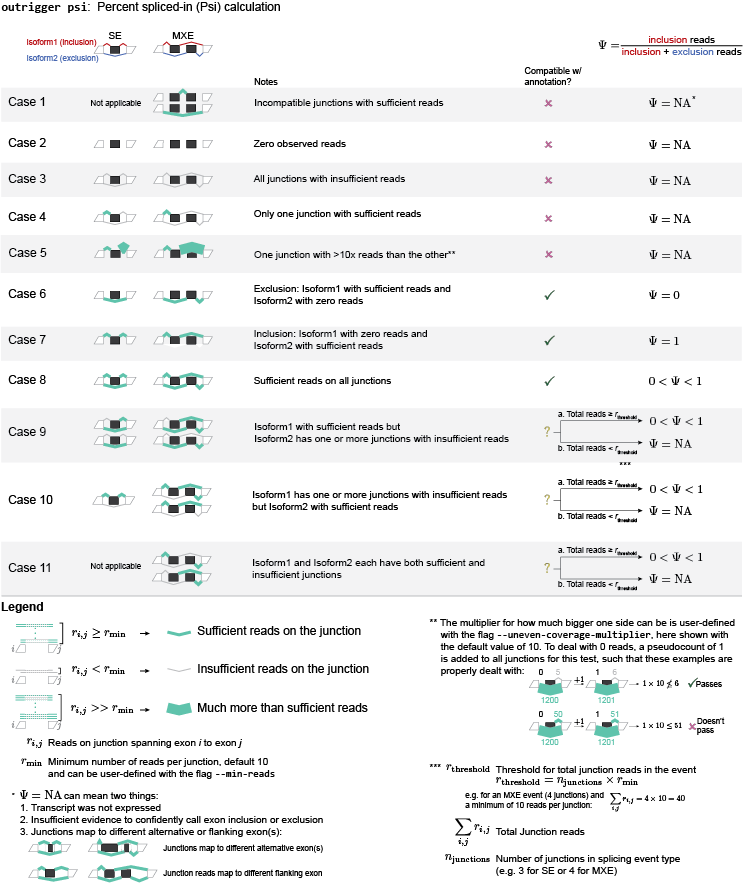

``psi``: Calculate percent spliced-in (Psi/Ψ) scores for your data from the splicing events you created
=======================================================================================================

Overview
--------

``outrigger psi`` uses the splicing events created by `outrigger index`_, or,
if `outrigger validate`_ has been run, only the valid alternative splicing
events with appropriate splice sites.

|OutriggerPsi|

.. |OutriggerLogo| image:: https://raw.githubusercontent.com/YeoLab/outrigger/master/logo/logo_v1.png
    :target: https://github.com/YeoLab/outrigger

Inputs
------

If you used the default output folders for ``outrigger index`` and ``outrigger validate``, then you can use the command,

::

    outrigger psi

To run the percent spliced-in calculation.

The above command is equivalent to specifying all the arguments with
their default values:

::

    outrigger psi --index ./outrigger_index --min-reads 10

Below is the full usage output when you ``outrigger psi -h``:

::

    $ outrigger psi -h
    usage: outrigger psi [-h] [-i INDEX] [-o OUTPUT]
                         [-c COMPILED_JUNCTION_READS | -j [SJ_OUT_TAB [SJ_OUT_TAB ...]]
                         | -b [BAMS [BAMS ...]]] [-m MIN_READS]
                         [--ignore-multimapping] [--reads-col READS_COL]
                         [--sample-id-col SAMPLE_ID_COL]
                         [--junction-id-col JUNCTION_ID_COL] [--debug]
                         [--n-jobs N_JOBS]

    optional arguments:
      -h, --help            show this help message and exit
      -i INDEX, --index INDEX
                            Name of the folder where you saved the output from
                            "outrigger index" (default is
                            ./outrigger_output/index, which is relative to the
                            directory where you called this program, assuming you
                            have called "outrigger psi" in the same folder as you
                            called "outrigger index")
      -o OUTPUT, --output OUTPUT
                            Name of the folder where you saved the output from
                            "outrigger index" (default is ./outrigger_output,
                            which is relative to the directory where you called
                            the program). Cannot specify both an --index and
                            --output with "psi"
      -c COMPILED_JUNCTION_READS, --compiled-junction-reads COMPILED_JUNCTION_READS
                            Name of the compiled splice junction file to calculate
                            psi scores on. Default is the '--output' folder's
                            junctions/reads.csv file. Not required if you specify
                            SJ.out.tab files with '--sj-out-tab'
      -j [SJ_OUT_TAB [SJ_OUT_TAB ...]], --sj-out-tab [SJ_OUT_TAB [SJ_OUT_TAB ...]]
                            SJ.out.tab files from STAR aligner output. Not
                            required if you specify a file with "--compiled-
                            junction-reads"
      -b [BAMS [BAMS ...]], --bams [BAMS [BAMS ...]]
                            Bam files to use to calculate psi on
      -m MIN_READS, --min-reads MIN_READS
                            Minimum number of reads per junction for calculating
                            Psi (default=10)
      --ignore-multimapping
                            Applies to STAR SJ.out.tab files only. If this flag is
                            used, then do not include reads that mapped to
                            multiple locations in the genome, not uniquely to a
                            locus, in the read count for a junction. If inputting
                            "bam" files, then this means that reads with a mapping
                            quality (MAPQ) of less than 255 are considered
                            "multimapped." This is the same thing as what the STAR
                            aligner does. By default, this is off, and all reads
                            are used.
      --reads-col READS_COL
                            Name of column in --splice-junction-csv containing
                            reads to use. (default='reads')
      --sample-id-col SAMPLE_ID_COL
                            Name of column in --splice-junction-csv containing
                            sample ids to use. (default='sample_id')
      --junction-id-col JUNCTION_ID_COL
                            Name of column in --splice-junction-csv containing the
                            ID of the junction to use. Must match exactly with the
                            junctions in the index.(default='junction_id')
      --debug               If given, print debugging logging information to
                            standard out
      --n-jobs N_JOBS       Number of threads to use when parallelizing psi
                            calculation and file reading. Default is -1, which
                            means to use as many threads as are available.

Outputs
-------

Now the ``outrigger_output`` folder has ``psi`` subfolder, with the MXE
and SE events separate.

::

    $ tree outrigger_output
    outrigger_output
    ├── index
    │   ├── gtf
    │   │   ├── gencode.vM10.annotation.subset.gtf
    │   │   ├── gencode.vM10.annotation.subset.gtf.db
    │   │   └── novel_exons.gtf
    │   ├── junction_exon_direction_triples.csv
    │   ├── mxe
    │   │   ├── event.bed
    │   │   ├── events.csv
    │   │   ├── exon1.bed
    │   │   ├── exon2.bed
    │   │   ├── exon3.bed
    │   │   ├── exon4.bed
    │   │   ├── intron.bed
    │   │   ├── splice_sites.csv
    │   │   └── validated
    │   │       └── events.csv
    │   └── se
    │       ├── event.bed
    │       ├── events.csv
    │       ├── exon1.bed
    │       ├── exon2.bed
    │       ├── exon3.bed
    │       ├── intron.bed
    │       ├── splice_sites.csv
    │       └── validated
    │           └── events.csv
    ├── junctions
    │   ├── metadata.csv
    │   └── reads.csv
    └── psi
        ├── mxe
        │   └── psi.csv
        ├── outrigger_psi.csv
        └── se
            └── psi.csv

    10 directories, 26 files

.. _outrigger index: outrigger_index.html
.. _outrigger validate: outrigger_validate.html
