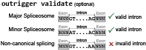

``validate``: Check that the found exons are real
=================================================

Overview
--------

|OutriggerValidate|

Inputs
------

After you run ``outrigger index``, you have the following directory structure:

::

    $ tree outrigger_output/index
    outrigger_output
    ├── index
    │   ├── gtf
    │   │   ├── gencode.vM10.annotation.subset.gtf
    │   │   ├── gencode.vM10.annotation.subset.gtf.db
    │   │   └── novel_exons.gtf
    │   ├── junction_exon_direction_triples.csv
    │   ├── mxe
    │   │   ├── event.bed
    │   │   ├── events.csv
    │   │   ├── exon1.bed
    │   │   ├── exon2.bed
    │   │   ├── exon3.bed
    │   │   ├── exon4.bed
    │   │   └── intron.bed
    │   └── se
    │       ├── event.bed
    │       ├── events.csv
    │       ├── exon1.bed
    │       ├── exon2.bed
    │       ├── exon3.bed
    │       └── intron.bed
    └── junctions
        ├── metadata.csv
        └── reads.csv

    5 directories, 19 files

The ``outrigger validate`` command relies on this structure and

This example command assumes that you have a ``mm10`` genome fasta file
located at
``~/genomes/mm10/gencode/m10/GRCm38.primary_assembly.genome.fa`` and a
chromosome sizes file located at ``~/genomes/mm10/mm10.chrom.sizes``

::

    outrigger validate -f ~/genomes/mm10/gencode/m10/GRCm38.primary_assembly.genome.fa -g ~/genomes/mm10/mm10.chrom.sizes

Outputs
-------

Now there is a new folder in the ``outrigger_output/index/mxe`` and
``outrigger_output/index/se`` folders called ``validated``. Plus, there is a file

::

    $ tree outrigger_output/index
    outrigger_output/index
    ├── gtf
    │   ├── gencode.vM10.annotation.subset.gtf
    │   ├── gencode.vM10.annotation.subset.gtf.db
    │   └── novel_exons.gtf
    ├── junction_exon_direction_triples.csv
    ├── mxe
    │   ├── event.bed
    │   ├── events.csv
    │   ├── exon1.bed
    │   ├── exon2.bed
    │   ├── exon3.bed
    │   ├── exon4.bed
    │   ├── intron.bed
    │   ├── splice_sites.csv
    │   └── validated
    │       └── events.csv
    └── se
        ├── event.bed
        ├── events.csv
        ├── exon1.bed
        ├── exon2.bed
        ├── exon3.bed
        ├── intron.bed
        ├── splice_sites.csv
        └── validated
            └── events.csv

    5 directories, 21 files
